# Practical-SQL-for-Enhanced-Business-Intelligence-

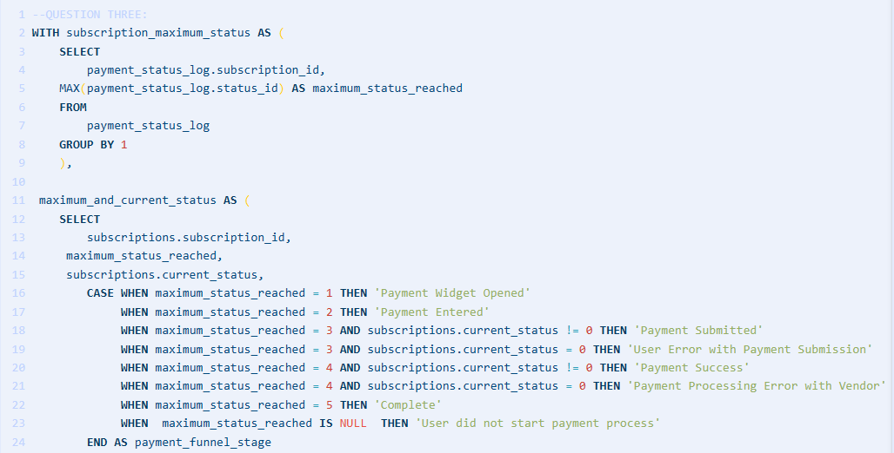

*Note: The sql code can be found above in the document named Project_SQL_Query*

## INTRODUCTION

In this comprehensive project, I showcase my proficiency in SQL, acquired through a rigorous course led by a seasoned data analyst [Jess Ramos](linkedin.com/in/jessramosmsba). The [course](https://www.linkedin.com/learning/solve-real-world-data-problems-with-sql/advancing-your-skills-with-sql?resume=false), tailored towards real-world problem-solving in the business realm, provided valuable insights into addressing pressing issues encountered in the business world.

I would like to extend my gratitude to her, the expert instructor who guided me through this enlightening journey. With her consent, I have meticulously crafted this practical course into my project portfolio, thereby reproducing the knowledge gained during the course.

This project not only highlights the technical skills acquired but also serves as a testament to my dedication and ability to translate theoretical concepts into practical solutions. Despite not having access to the course datasets, I tackled this challenge by creating the same dataset used in the course, showcasing my problem-solving approach and analytical mindset.

The portfolio encompasses a diverse range of business problems, including calculating descriptive statistics for monthly revenue by product, tracking user activity with frontend events, flagging upsell opportunities for the sales team, payment funnel analysis, analyzing subscription cancellation reasons, pulling employee/manager data, comparing MoM revenue, and tracking sales quota progress over time. Each segment of the project reflects a distinct business scenario, demonstrating my adaptability and proficiency in SQL.

Join me in exploring the dynamic landscape of data analytics through this project, where theory meets practice, and real-world problems find data-driven solutions.

## DATA MODEL

### Main Data Model

### Sales Data Model

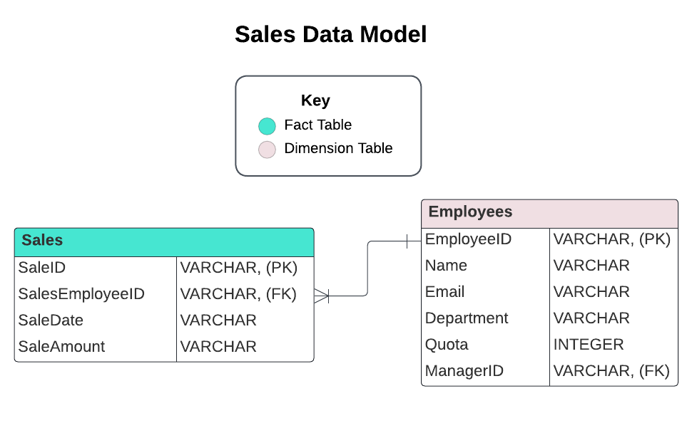

### Subscriptions Data Model

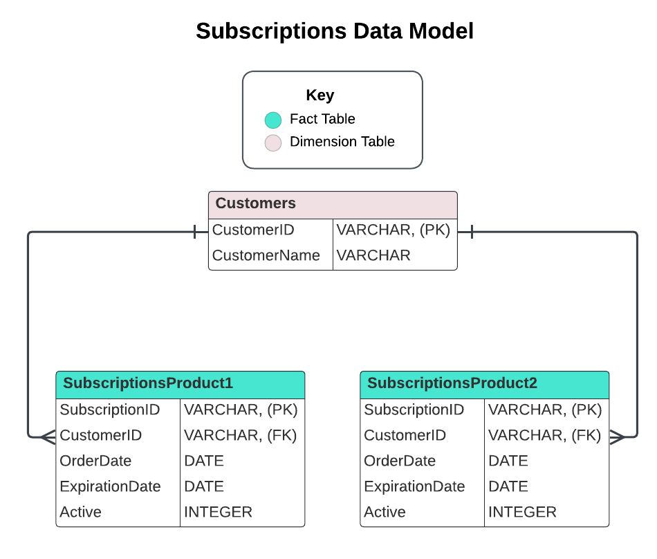

## QUESTIONS

### 1. CTE practice: Calculating descriptive statistics for monthly revenue by product.

*Business problem*: The Leadership team at my company is making goals for 2023 and wants to understand
how much revenue each of the product subscriptions(basic and expert) are generating each
month. More specifically, they want to understand the distribution of monthly revenue across
the past year, 2022.
 
They have asked me the following questions:
- (A) How much revenue does each product usually generate each month?
- (B) Which product had the most success throughout all of last year?
- (C) Did either product flunctuate greatly each month or was the month-to-month trend fairly consistent?
 
Also, this request is for a board meeting tomorrow, I decided that a granular report(a level of detail or precision of the report) of monthly revenue by product
probably isn't the best deliverable, because a large table of numbers isn't great for gleaning quick insights.Instead,
I decided to calculate something of more high-level: minimum, maximum, average, and standard deviation of monthly revenue for each product for the year 2022. This will equip the leadership with a 
quick summary of the revenue and consistency that each product provided last year.

*To solve this business problem, the subscriptions and product table will be used.*

Answer:

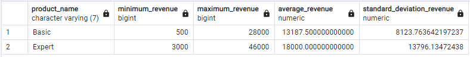

### 2. Exploring variable distribution with CTEs

*Business problem*: The manager on the marketing team comes to me to ask about the performance of their recent email campaign. Now
that the campaign has been launched, the marketing manager wants to know how many users have clicked the link in the email.  
While this project was being planned,I collaborated with the front-end engineers to create tracking events for the 
front end of the product located in the front_end_event_log table. One of these events, event_id = 5, is logged when the user
reaches a unique landing page that is only accessed from this campaign email.
Since the event tracks when a user views the unique landing page from the email, tracking event_id = 5 will be the best method to count how many users have clicked the link in the campaign email.

I decided it's best to calculate the distribution of the number of email link clicks per users.

*To solve this business problem, the users and frontend event log table will be used.*

Answer:

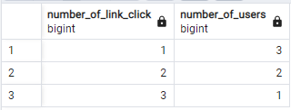

### 3. Payment funnel analysis with multiple CTEs

*Business problem*: The product manager has requested a payment funnel from the analytics team;she wants to understand
what the furthest point in the payment process users are getting to and where users are falling out of the process.She wants to have a full visibility into 
each possible stage of the payment process from the user's point of view.

Here's the payment process a user goes through when signing up for a subcription:
1. The user opens the widget to initiate payment process.
2. The user types in credit card information.
3. The user clicks the submit button to complete their part of the payment process.
4. The product sends the data to the third-party payment processing company.
5.The payment company completes the transaction and reports back with 'complete'. 

The process is converted into status_id using the follwing mapping in the status_definition table below:

Table view of status_definition

As subscriptions move through the statuses, the movements are logged in the payments_status_log table using the status_id. Users can go back and forth and move through statuses multiple times. 

Below is the Subscriptions payment funnel stage

Answer:

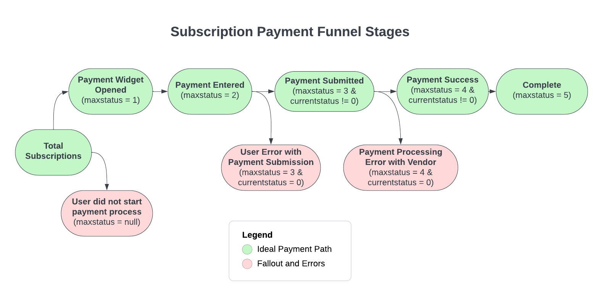

To determine a subscription's payment_funnel_stage, I will consider its maximum status_id because this will show the furthest point in the workflow that they successfully reached.
In addition to the max_status, I also want to consider if the subscriptions is currently stuck in an error using the current_status column from the subscriptions table.

*Note: If a user reaches status_id = 3 but submits an incorrect card number, the transaction will be stopped and they will see an error message. The user will then need to restart the process and use the correct information. 
This is considered a user error. If a user reaches status_id = 4 and submits correct payment information, the data is sent to a third-party payment company. If the are unable to process the data and complete the transaction due to an error on their end, it will produce an error message to the user. This is considered a vendor error.*

I want to differentiate between these two different user fallout reasons in my funnel analysis, because they point to different business actions to fix them.

*To solve this business problem, the payment_status_log and subscriptions table will be used.*

### 4. Creating binary columns with CASE

*Business Problem*: Flagging upsell opportunities for the sales team

The product team is launching a new product offering that can be added on top of a current subscription for an increase in the customer's annual fee. 
The sales team has decided that they want to reach out to a select group of customers to offer the new product and get feedback before offering it to the entire
customer base. 

They have decided it would be best to reach out to customers who meet one of the following two conditions:
- (I). Have at least 5,000 registered users: This is because companies with large amount of users are a significant upsell opportunity, because they can lead to more potential revenue.
Or
- (II). Only have one product subcriptions: Based on conversation the sales team has had with customers, the companies that already have subscriptions for two products are not willing to spend more and add on thier current subscriptions.

I decided to help out the sales team by providing them a report with all current customers(customer_id) and the number of product subscriptions(number_of_product) and registered users(total_users) they
currently have. To make it extra easy for the sales team to identify customers that are upsell opportunity, I also include a binary column(upsell_opportunity) that flags the customers
that meeet one of these conditions.

*To solve this business problem, the subscriptions table will be used.*

Answer:

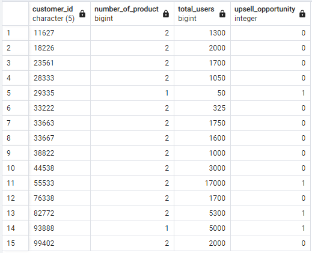

### 5. Pivoting rows into aggregated columns with CASE
   
*Business Problem*: Tracking user activity with frontend events

The design team recently redesigned the customer support page on the website, and they want to run an AB test to see how
the newly designed page performs compared to the original. An AB test is a statistical test used frequently used in 
data science to meansure the impact changes have on specified metrics. The users will be randomly assigned
into two groups(Control and Treatment).The users in control group will see the current customer support page, the users in treatment,
will see the new page design. The analytics teams needs to track user activity via frontend events(button clicking, page viewing, etc) to inform the product team
for future iterations. At the end of the experiment, the results of the control and treatment group will be compared to make a final recommendation.

I decided that it will be important to track user activity and ticket submissions on the customer support page since they could
be impacted, either positively or negatively, by the deisgn changes. I choose the following events to track:

- When a user views the help centre page: viewed_help_center_page (eventid = 1)
- When a user clicks on the frequently asked questions link: clicked_faqs (eventid = 2)
- When a user clicks the contact customer support button: clicked_contact_support (eventid = 3)
- When a user clicks the submit ticket button: submitted_ticket (eventid = 4)

I decided to count the number of times a user completes events above.

*To solve this business problem, the frontend_event_definitions table will be used.(where event_type = 'Customer Support)*

Answer:

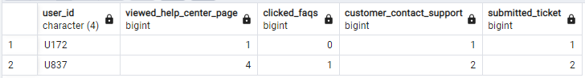

### 6. Combining Multiple Tables Using UNION

*Business Problem*: Combining 2 Product tables into 1

The chief growth officer  is focused on reducing churn, or the number of customers that don't annual subscriptions.
She is planning to launch mutilple product experiments and marketing campaigns thoughtout 2023 to drive users 
to renew subscriptions. She's first conducting research to understand the potential impact that the churn initiative can have on the business.
She reaches out to my team and asks when all active subscriptions are going to expire.

Because of data modelling limitations, my company was prevented from putting both products in the same table, so there are currently seperates tables for each product, 
subscription_product_1 and subscription_product_2.

*To solve this business problem, the subscriptions_product_1 and subscriptions_product_2 tables will be used.*

Answer:

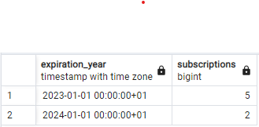

### 7. Unpivoting columns into rows using UNION

*Business Problem*: Analyzing Subscription Cancellation Reasons

Since the chief growth officer is tackling churn next year, one of her big question is:'Why are users cancelling and not renewing their subscriptions?'
Knowing why users aren't renewing their subscriptions will be a key insights into how to prevent churn in the future. Is it because they don't like the product? Are they leaving 
for a competitor? Or maybe it's out of budget and too expensive for them? Only the data can help us know for sure!
When users decide to cancel their subcription,they're able to select up to three reasons for cancelling out of a preset list. 
Users can't select the same reason twice, and some users may even select less than three reasons and have null values in some of the cancellation reason columns. Since the economy has been 
tough lately, I decide to pull the percent of cancelled subscriptions that cancelled due to the product being too expensive.

*To solve this business problem, the cancelations table will be used.*

Answer:

### 8. Using self joins to pull hierarchical relationship

*Business problem*: Pulling employee/manager data with a self join

The VP of sales is currently contacting all of the managers who have direct reports in the sales department to notify of them of the new commission structure. 
Using the employees table, which containis all employees and their associated manager, I can pull a report of all sales employees and thier manager's email address using a self join. However, with
my sharp thinking, I notice that several employees have null values for thier manager's email address due to the
fact that some employees don't have a manager logged in the database.

Considering that the goal of this business problem is to spread the word about an important business change that will affect
the sales team, I know that null email addresses won't be useful in the output. I mean... how would you feel if I weren't notified of this important change because
I didn't have a manager logged for me in the database? I can't always accept null values, and sometimes I have to recode them or impute them with another
value that is more meaningful for the business. Without bothering the super busy VP with this, I take the initiative and modify your query so that it replace
all null manager emails with the employees email. This way, all sales employees without a manager emal will receive the information directly.

Expectation: Create an email list from the employees table that include the following columns for all employees under department = 'Sales'
employee_id, employee_name, manager_name and contact_email(use the manager email if available and the enployee email if not)

*To solve this business problem, the sales and employees table will be used*

Answer:

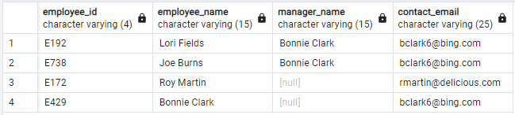

### 9.Using Self Joins to compare Rows within the same table

*Business problem*: Comparing MoM Revenue

It's time for end-of-year reporting, and my manager wants me to put together a slide deck summarizing the top revenue highlights of the year and present 
it to the whole company on the all-hands call. Among other metrics and insights, my manager suggests that I highlight months where revenue was month-over-month(MoM).
In other words, she wants me to highlight the months where revenue was up from the previous month. 

*To solve this business problem,the subscriptions table will be used.*

Answer:

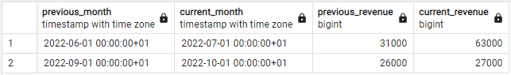

### 10. Tracking Running Totals with Window Functions

*Business Problem*: Tracking Sales Quota progress over Time

The sales team works diligently to sell the product, and they have quotas that they must reach in other to earn all of their
commission. Because these goals are so intimately tied to revenue, the manager of the team wants to track each sales member's performance throughout the year. I suggest a percentage of quota
reached metric that could be displayed on a dashboard, but the sales manager express her concern that a single metric won't give her visibility into their progress throughout the year. I suggest providing 
a running total of sales revenue and a percent_quota metric that will be recalculated every time a sales member makes another sale. She agrees, and I got started.

*To solve this business problem, the sales and employees table will be used to answer this. (Expected columns: sales_employee_id, sales_date, sale_amount, quota, runninig total and percent_total extracted)*

Answer:

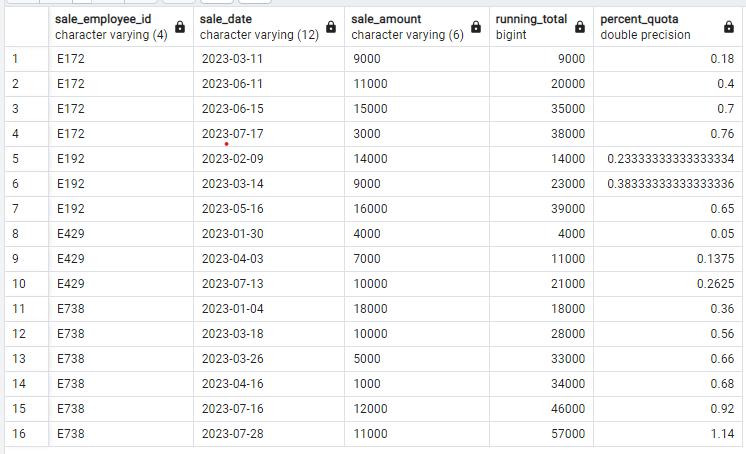

### 11. Consecutive Timestamp Difference with LEAD()

*Business Problem*: Tracking User Payment Funnel Times with LEAD()

A customer has complained that it took long for them to complete their payment due to there being an error with the system.
The customer support team brought this issue up and asked the analytics team to investigate the payment funnel
time data for subscriptionid = 38844

As subscriptions move through the payment statuses, trhey are logged in the payment_status_log table using the statusid
to show what status they moved to. They can go back and forth and more through statuses multiple times.

Each step of the payment process from the user point of view is outlined below:
Here's the payment process a user goes through when signing up for a subcription:
1. The user opens the widget to initiate payment process.
2. The user types in credit card information.
3. The user clicks the submit button to complete their part of the payment process.
4. The product sends the data to the third-party payment processing company.
5.The payment company completes the transaction and reports back with 'complete'. 

The process is converted into status_id using the follwing mapping in the status_definition table below:

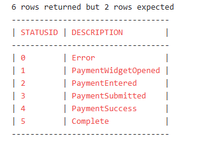

As subscriptions move through the statuses, the movements are logged in the payments_status_log table using the status_id. Users can go back and forth and move through statuses multiple times. 
More information on this can be found in the status definition table.

I'm expected to pull payment funnel data for subscription_id = 38844. For each status timestamp, then calculate the time difference between that timestamp and the next chronological timestamp in order to show how long the user was in each status before moving to the next status. 
(Expected are susbcription_movement_id, subscription_id, status_id, movement_id, next_status_movement_date and time_in_status.)

*To solve this business problem, the payment_status_log table will be used to answer this.*

Answer:

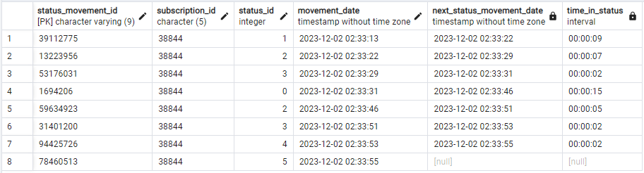

## CONCLUSION

I was able to learn about and get experience with how a senior analyst goes about her daily work by taking on embarking on this project.
In addition, this project gave me the basic skills and insight that I need to be successful in my current data analytics work. Along with learning about certain terminologies (such funnel analysis, product analytics, interactions between employees and managers, etc.), I also gained some guidance on how to proceed with conducting analysis in those areas.

*Note: The sql code can be found above in the document named Project_SQL_Query*
